# ☁️ Enterprise-Grade Serverless Cloud Architecture (AWS)

**Live Deployment:** [https://www.aswinarasu.com](https://www.aswinarasu.com)

---

## 📖 Executive Summary

This repository contains the source code and infrastructure documentation for a **high-availability, globally scalable** personal portfolio website.

The project serves as a technical case study in **Cloud-Native Architecture**. Instead of traditional hosting, it leverages the **AWS Serverless ecosystem** (S3, CloudFront, ACM, IAM) to achieve enterprise-grade performance and security while strictly adhering to a **near-zero cost model** (< ₹1 INR / month).

The deployment pipeline is fully automated using **GitHub Actions** and secured via **OpenID Connect (OIDC)**, eliminating the need for long-term IAM credentials.

---

## 🏗️ Architectural Blueprint

The architecture follows the **AWS Well-Architected Framework**, focusing on the **Security**, **Performance Efficiency**, and **Cost Optimization** pillars.

### 📊 System Architecture Diagram


---

### 1. The Request Flow (Life of a Packet)

```
User Request → GoDaddy DNS → CloudFront Edge → S3 Origin → Response
```

---

### 2. 🔍 What Happens When a User Clicks a Link? (Detailed Walkthrough)

When a user types `www.aswinarasu.com` in their browser or clicks a link, the following sequence of events occurs:

```mermaid
sequenceDiagram
    autonumber
    participant U as 👤 User Browser
    participant DNS as 🌐 GoDaddy DNS
    participant CF as ⚡ CloudFront Edge
    participant ACM as 🔐 AWS ACM
    participant S3 as 📦 S3 Bucket

    Note over U,S3: 🚀 PHASE 1: DNS Resolution (~50ms)
    U->>DNS: GET www.aswinarasu.com
    DNS->>DNS: Lookup CNAME Record
    DNS-->>U: Return d1234.cloudfront.net

    Note over U,S3: 🔒 PHASE 2: TLS Handshake (~100ms)
    U->>CF: TCP + TLS 1.3 Handshake
    CF->>ACM: Fetch SSL Certificate
    ACM-->>CF: Valid Certificate (*.aswinarasu.com)
    CF-->>U: Secure Connection Established ✅

    Note over U,S3: ⚡ PHASE 3: Content Delivery
    U->>CF: HTTPS GET /index.html
    
    alt Cache HIT (< 20ms)
        CF-->>U: 🎯 Return Cached Content
    else Cache MISS (~100ms)
        CF->>CF: Sign Request with OAC
        CF->>S3: Authenticated Request
        S3->>S3: Validate OAC Signature
        S3-->>CF: Return Object
        CF->>CF: Cache Object at Edge
        CF-->>U: Return Fresh Content
    end

    Note over U,S3: ✅ Page Rendered Successfully!
```



---

### 3. 📋 Step-by-Step Breakdown

#### 🌐 STEP 1: DNS Resolution (GoDaddy)
| Action | Details | Time |
|--------|---------|------|
| User enters URL | `www.aswinarasu.com` | 0ms |
| Browser DNS Query | Sent to GoDaddy nameservers | ~10ms |
| CNAME Lookup | `www.aswinarasu.com` → `d1234.cloudfront.net` | ~20ms |
| IP Resolution | CloudFront returns nearest Edge IP | ~20ms |

> [!NOTE]
> GoDaddy was chosen over AWS Route 53 to save the $0.50/month hosted zone fee.

---

#### 🔐 STEP 2: Secure Connection (TLS 1.3)

```mermaid
flowchart LR
    subgraph HANDSHAKE["🔒 TLS 1.3 Handshake"]
        A[ClientHello] --> B[ServerHello + Cert]
        B --> C[Key Exchange]
        C --> D[🔐 Encrypted Tunnel]
    end
    
    style HANDSHAKE fill:#1a1a2e,stroke:#00d9ff,stroke-width:2px
    style D fill:#00d9ff,stroke:#00d9ff,color:#000
```



| Security Feature | Implementation |
|-----------------|----------------|
| **Protocol** | TLS 1.3 (Latest & Most Secure) |
| **Certificate** | AWS ACM (Auto-Renewed) |
| **Cipher Suite** | ECDHE + AES-256-GCM |
| **HSTS** | Enabled (Force HTTPS) |

---

#### ⚡ STEP 3: Edge Network Entry (CloudFront)
- Request is routed to the nearest **AWS Edge Location** (Point of Presence) based on lowest latency
- Over **450+ Points of Presence** globally for optimal performance
- **TLS 1.3 Handshake:** CloudFront terminates the SSL connection using a public certificate managed by AWS ACM

---

#### 📊 STEP 4: Cache Decision Logic

```mermaid
flowchart TD
    A[📨 Incoming Request] --> B{Cache Check}
    B -->|HIT| C[⚡ Return from Edge Cache]
    B -->|MISS| D[🔐 Sign with OAC]
    D --> E[📤 Forward to S3 Origin]
    E --> F[📥 Fetch Object]
    F --> G[💾 Store in Edge Cache]
    G --> H[📤 Return to User]
    C --> I[✅ Response Complete]
    H --> I

    style A fill:#667eea,stroke:#667eea,color:#fff
    style C fill:#00d9ff,stroke:#00d9ff,color:#000
    style I fill:#48bb78,stroke:#48bb78,color:#000
```



| Scenario | Action | Latency | Header Indicator |
|----------|--------|---------|------------------|
| **Cache Hit** | File returned from Edge Cache immediately | < 20ms | `x-cache: Hit from cloudfront` |
| **Cache Miss** | CloudFront forwards request to Origin (S3) | ~100ms | `x-cache: Miss from cloudfront` |
| **Cache Refresh** | TTL expired, revalidate with origin | ~80ms | `x-cache: RefreshHit from cloudfront` |

---

#### 🛡️ STEP 5: Security Perimeter (Origin Access Control)

```mermaid
flowchart LR
    subgraph SECURITY["🛡️ OAC Security Layer"]
        CF[CloudFront] -->|Signed Request| V{Validate Signature}
        V -->|✅ Valid| S3[S3 Bucket]
        V -->|❌ Invalid| DENY[403 Forbidden]
    end
    
    DIRECT[🚫 Direct S3 Access] --> DENY

    style CF fill:#ff6b35,stroke:#ff6b35,color:#fff
    style S3 fill:#48bb78,stroke:#48bb78,color:#000
    style DENY fill:#fc5c65,stroke:#fc5c65,color:#fff
    style DIRECT fill:#fc5c65,stroke:#fc5c65,color:#fff
```



**How OAC Works:**
1. CloudFront generates a **Signature Version 4** signed request
2. The signature includes: Distribution ID, Timestamp, Request Path
3. S3 validates this signature against the bucket policy
4. Only requests with valid CloudFront signatures are allowed

---

#### 📦 STEP 6: Origin Fetch (S3)
- The S3 Bucket policy validates the OAC signature
- If valid, S3 serves the object with appropriate headers
- Response flows back through CloudFront to the user

> [!IMPORTANT]
> Direct access to the S3 bucket URL is **strictly blocked**. All traffic MUST flow through CloudFront.

---

### 4. 🎯 End-to-End Latency Summary

| Phase | Typical Latency | Cumulative |
|-------|-----------------|------------|
| DNS Resolution | ~50ms | 50ms |
| TLS Handshake | ~100ms | 150ms |
| Edge Cache Hit | ~20ms | **170ms** |
| OR Origin Fetch | ~100ms | **250ms** |

> [!TIP]
> First-time visitors may experience ~250ms latency, but subsequent requests benefit from edge caching with **sub-100ms response times**!

---

## 🛠️ Detailed Implementation Guide

### 1. Amazon S3 (Storage Layer)

| Setting | Value |
|---------|-------|
| **Bucket Name** | `aswinarasu-prod` |
| **Region** | `ap-south-1` (Mumbai) |
| **Block Public Access** | ✅ On (All 4 checkboxes checked) |
| **Bucket Versioning** | ✅ Enabled (For rollback capability) |
| **Server-side Encryption** | Amazon S3 managed keys (SSE-S3) |
| **Static Website Hosting** | ❌ Disabled (Using CloudFront) |

### 2. AWS Certificate Manager (ACM)

| Setting | Value |
|---------|-------|
| **Certificate Type** | Public |
| **Region** | `us-east-1` (N. Virginia) |
| **Domain Names** | `aswinarasu.com`, `www.aswinarasu.com` |
| **Validation Method** | DNS Validation |

> [!WARNING]
> CloudFront requires certificates to be in **us-east-1**, even if the S3 bucket is in another region.

### 3. AWS CloudFront (CDN Layer)

| Setting | Value |
|---------|-------|
| **Origin** | S3 Bucket (`aswinarasu-prod`) |
| **Origin Access** | Origin Access Control (OAC) with "Sign Requests" |
| **Viewer Protocol Policy** | Redirect HTTP to HTTPS |
| **Allowed HTTP Methods** | GET, HEAD |
| **Price Class** | Use all edge locations (Best Performance) |
| **Alternate Domain Names** | `www.aswinarasu.com` |
| **Custom SSL Certificate** | ACM Certificate |
| **Default Root Object** | `index.html` |

---

## 4. IAM & Security (The "Zero Trust" Setup)

This section details how the architecture prevents unauthorized access and updates.

### A. S3 Bucket Policy (Restricting Read Access)

This policy strictly ensures that **only CloudFront** can access the files. Users trying to bypass CloudFront to access S3 directly will be denied.

```json
{
    "Version": "2012-10-17",
    "Statement": [
        {
            "Sid": "AllowCloudFrontServicePrincipal",
            "Effect": "Allow",
            "Principal": {
                "Service": "cloudfront.amazonaws.com"
            },
            "Action": "s3:GetObject",
            "Resource": "arn:aws:s3:::aswinarasu-prod/*",
            "Condition": {
                "StringEquals": {
                    "AWS:SourceArn": "arn:aws:cloudfront::YOUR_ACCOUNT_ID:distribution/YOUR_DIST_ID"
                }
            }
        }
    ]
}
```

### B. OIDC & Write Protection (Restricting Update Access)

To ensure that no one else can update the website content, I utilized **OpenID Connect (OIDC)** with a strict Trust Relationship.

- **Identity Provider:** Added `token.actions.githubusercontent.com` to IAM Identity Providers
- **IAM Role Trust Relationship:**

> [!CAUTION]
> The `Condition` block below acts as a security lock. It ensures that AWS allows the deployment action **only if** the request comes from the specific GitHub repository owned by the authorized user. Even if another user forks this repository, their deployment will fail.

```json
{
    "Version": "2012-10-17",
    "Statement": [
        {
            "Effect": "Allow",
            "Principal": {
                "Federated": "arn:aws:iam::YOUR_ACCOUNT_ID:oidc-provider/token.actions.githubusercontent.com"
            },
            "Action": "sts:AssumeRoleWithWebIdentity",
            "Condition": {
                "StringLike": {
                    "token.actions.githubusercontent.com:sub": "repo:arasuaswin/aswin-portfolio:*"
                },
                "StringEquals": {
                    "token.actions.githubusercontent.com:aud": "sts.amazonaws.com"
                }
            }
        }
    ]
}
```

---

## 🤖 CI/CD Automation (GitHub Actions)

The deployment is handled by the `.github/workflows/deploy.yml` file.

### Pipeline Stages

```mermaid
graph LR
    A[📥 Checkout] --> B[🔐 OIDC Auth]
    B --> C[📤 S3 Sync]
    C --> D[🗑️ Cleanup]
    D --> E[🔄 CloudFront Invalidation]
```



| Stage | Description |
|-------|-------------|
| **Checkout** | Pulls the code from the repository |
| **Auth** | Uses `aws-actions/configure-aws-credentials` to request a temporary session token via OIDC |
| **Sync** | Uses `aws s3 sync` to upload files |
| **Optimization** | The `--delete` flag removes files from S3 that no longer exist in the repo |
| **Invalidate** | Triggers a CloudFront invalidation (`/*`) to force edge locations to fetch the latest version |

---

## 💰 Detailed Cost Analysis (Monthly)

This architecture utilizes the **AWS Free Tier** and "Pay-as-you-go" pricing effectively.

| Service | Specific Usage | Unit Cost | Monthly Estimate |
|---------|----------------|-----------|------------------|
| **AWS S3** | 20MB Storage | $0.023/GB | **$0.00046** |
| **AWS S3** | 200 PUT Requests (Deploys) | $0.005/1000 | **$0.001** |
| **CloudFront** | 10GB Data Transfer | Free (First 1TB/mo) | **$0.00** |
| **CloudFront** | 10,000 HTTP Requests | Free (First 10M/mo) | **$0.00** |
| **ACM** | Public SSL Certificate | Free | **$0.00** |
| **GitHub Actions** | 100 Build Minutes | Free (2000 free mins) | **$0.00** |
| **GoDaddy DNS** | DNS Management | Included with Domain | **$0.00** |
| **Route 53** | Hosted Zone | $0.50/mo | **AVOIDED** |

### **TOTAL: < $0.01 (₹0.83)**

---

## 🚀 How to Run Locally

To test the website on your local machine before pushing:

1. **Clone the repository:**
   ```bash
   git clone https://github.com/arasuaswin/aswin-portfolio.git
   ```

2. **Navigate to the directory:**
   ```bash
   cd aswin-portfolio
   ```

3. **Open `index.html` in your browser** or use a live server extension.

---

## 🤝 Contributing

1. Fork the Project
2. Create your Feature Branch (`git checkout -b feature/AmazingFeature`)
3. Commit your Changes (`git commit -m 'Add some AmazingFeature'`)
4. Push to the Branch (`git push origin feature/AmazingFeature`)
5. Open a Pull Request

---

## 📞 Contact & Socials

**R. Aswin** - *Cloud Engineer & AWS Certified Professional*

[](https://linkedin.com/in/aswinarasu)
[](https://aswinarasu.com)

---

<p align="center">
  <b>⭐ Star this repository if you found it helpful!</b>
</p>
